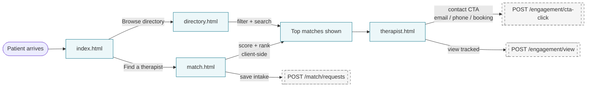
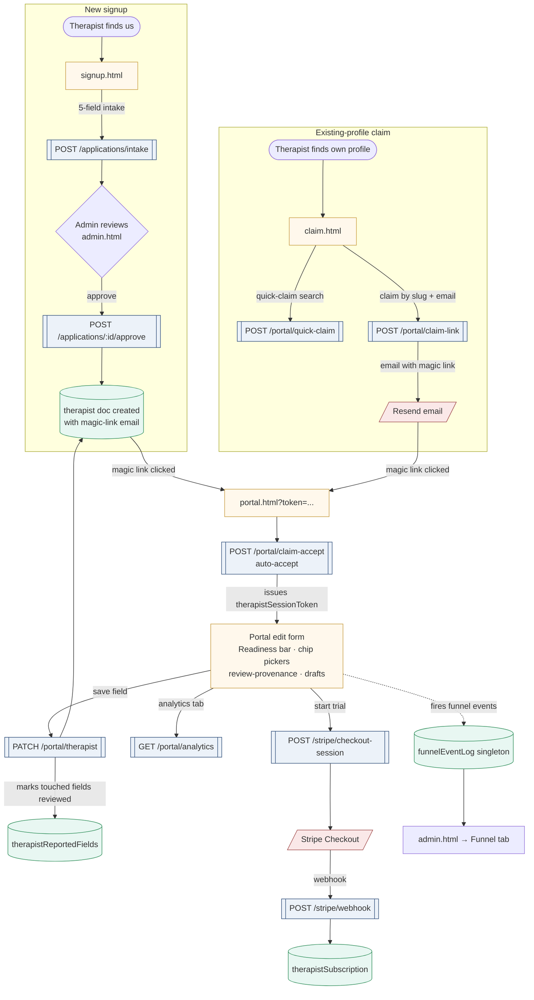
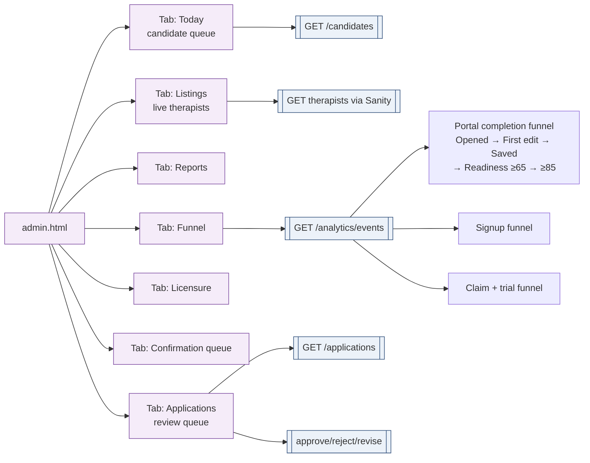

# Site map

Visual map of the BipolarTherapyHub surfaces, API endpoints, data layer, and external services. Diagrams use [Mermaid](https://mermaid.js.org/) — GitHub renders them inline, VS Code needs the "Markdown Preview Mermaid Support" extension.

## System overview

```mermaid
flowchart TB
  subgraph Public[Public HTML pages — patient-facing]
    Index[index.html<br/>homepage]
    Match[match.html<br/>guided match]
    Directory[directory.html<br/>searchable directory]
    Therapist[therapist.html<br/>public profile]
    Pricing[pricing.html<br/>therapist pricing]
  end

  subgraph Therapist[Therapist-facing pages]
    Signup[signup.html<br/>5-field intake]
    Claim[claim.html<br/>existing-profile claim]
    Portal[portal.html<br/>self-service editor]
  end

  subgraph Admin[Admin]
    AdminPanel[admin.html<br/>admin panel]
    Studio[Sanity Studio<br/>localhost:3333]
  end

  subgraph API[Review API — /api/review/*]
    AuthRoutes[auth + portal routes<br/>login, session, claim, edit]
    AppRoutes[application routes<br/>intake, approve, reject]
    CandRoutes[candidate routes<br/>ingest, review, publish]
    ReadRoutes[read routes<br/>applications, candidates, events]
    MatchRoutes[match routes<br/>requests + outcomes]
    StripeRoutes[stripe routes<br/>subscription, checkout, webhook]
    EngRoutes[engagement routes<br/>view + cta-click tracking]
    AnalyticsRoutes[analytics routes<br/>funnelEventLog append/read]
  end

  subgraph Data[Sanity data layer]
    DTherapist[therapist]
    DApp[therapistApplication]
    DCand[therapistCandidate]
    DEvent[therapistPublishEvent<br/>audit log]
    DPortalReq[therapistPortalRequest]
    DSub[therapistSubscription]
    DEngSum[therapistEngagementSummary<br/>per-week rollups]
    DMatchReq[matchRequest]
    DMatchOut[matchOutcome]
    DFieldObs[providerFieldObservation]
    DLicense[licensureRecord]
    DFunnel[funnelEventLog.singleton]
  end

  subgraph External[External services]
    Resend[Resend<br/>transactional email]
    Stripe[Stripe<br/>$19/mo paid_monthly]
    Vercel[Vercel<br/>hosting + DNS + analytics]
    DCA[CA DCA API<br/>license verification]
  end

  Public -->|browse| Therapist
  Index --> Match --> Therapist
  Index --> Directory --> Therapist
  Directory --> Therapist
  Therapist -->|contact CTA| EngRoutes

  Signup -->|POST /applications/intake| AppRoutes
  Claim -->|POST /portal/claim-link| AuthRoutes
  Claim -->|POST /portal/quick-claim| AuthRoutes
  Portal -->|GET /portal/me<br/>PATCH /portal/therapist| AuthRoutes
  Portal -->|GET /portal/analytics| AuthRoutes
  Portal -->|POST /stripe/checkout-session| StripeRoutes

  AdminPanel -->|POST /auth/login| AuthRoutes
  AdminPanel -->|GET /applications /candidates /events| ReadRoutes
  AdminPanel -->|approve/reject applications| AppRoutes
  AdminPanel -->|GET /analytics/events| AnalyticsRoutes
  AdminPanel -->|publish candidates| CandRoutes
  Studio --> Data

  AppRoutes --> DApp
  AppRoutes -->|on approval| DTherapist
  AppRoutes -->|writes| DEvent
  CandRoutes --> DCand
  CandRoutes -->|publish| DTherapist
  AuthRoutes -->|read + patch| DTherapist
  AuthRoutes --> DPortalReq
  ReadRoutes --> Data
  MatchRoutes --> DMatchReq
  MatchRoutes --> DMatchOut
  EngRoutes --> DEngSum
  AnalyticsRoutes --> DFunnel
  StripeRoutes --> DSub

  Match -->|client-side scoring| DTherapist
  Match -->|POST persist match| MatchRoutes
  Directory -->|CDN read| DTherapist
  Therapist -->|CDN read| DTherapist

  AuthRoutes -->|magic links, welcome,<br/>trial reminders| Resend
  AppRoutes -->|admin notify, applicant decision| Resend
  StripeRoutes -->|checkout + webhook| Stripe
  CandRoutes -->|verify CA license| DCA
  AppRoutes -->|verify CA license| DCA

  classDef publicStyle fill:#ecf7f9,stroke:#1a7a8f,stroke-width:2px
  classDef therapistStyle fill:#fff8ec,stroke:#c79a3c,stroke-width:2px
  classDef adminStyle fill:#f5ecf9,stroke:#7c4aa0,stroke-width:2px
  classDef apiStyle fill:#ecf2f9,stroke:#2f4e7a,stroke-width:2px
  classDef dataStyle fill:#e8f7f2,stroke:#2f8e5a,stroke-width:2px
  classDef extStyle fill:#fae8e8,stroke:#a04a4a,stroke-width:2px
  class Index,Match,Directory,Therapist,Pricing publicStyle
  class Signup,Claim,Portal therapistStyle
  class AdminPanel,Studio adminStyle
  class AuthRoutes,AppRoutes,CandRoutes,ReadRoutes,MatchRoutes,StripeRoutes,EngRoutes,AnalyticsRoutes apiStyle
  class DTherapist,DApp,DCand,DEvent,DPortalReq,DSub,DEngSum,DMatchReq,DMatchOut,DFieldObs,DLicense,DFunnel dataStyle
  class Resend,Stripe,Vercel,DCA extStyle
```

## Patient journey

## Therapist journey

## Admin surfaces

## Surface inventory

| Surface           | File                                                  | Role                                                                           |
| ----------------- | ----------------------------------------------------- | ------------------------------------------------------------------------------ |
| Homepage          | `index.html` + `assets/index.js`                      | Patient landing — funnel into match or directory                               |
| Match             | `match.html` + `assets/match.js`, `matching-model.js` | Guided intake; client-side scoring; persists `matchRequest`                    |
| Directory         | `directory.html` + `assets/directory.js`              | Searchable therapist list with filters                                         |
| Therapist profile | `therapist.html` + `assets/therapist-page.js`         | Public profile; tracks view/cta-click                                          |
| Signup            | `signup.html` + `assets/signup-new-listing.js`        | 5-field short-form intake → `therapistApplication`                             |
| Claim             | `claim.html` + `assets/signup-already-listed.js`      | Existing-profile claim flow; magic-link email                                  |
| Pricing           | `pricing.html`                                        | Therapist-facing pricing ($19/mo, 14-day trial)                                |
| Portal            | `portal.html` + `assets/portal.js`                    | Self-service edit: bio, chip pickers, readiness bar, review-provenance, drafts |
| Admin             | `admin.html` + `assets/admin-*.js`                    | Review queue, funnel dashboard, listings, licensure                            |
| Studio            | `studio/`                                             | Sanity CMS — direct doc editing                                                |

## API endpoint inventory

| Cluster       | Module                               | Key routes                                                                                                                |
| ------------- | ------------------------------------ | ------------------------------------------------------------------------------------------------------------------------- |
| Auth + portal | `review-auth-portal-routes.mjs`      | `/auth/login`, `/portal/me`, `PATCH /portal/therapist`, `/portal/claim-link`, `/portal/claim-accept`, `/portal/analytics` |
| Applications  | `review-application-routes.mjs`      | `POST /applications/intake`, `POST /applications/:id/approve`, `.../revise`                                               |
| Candidates    | `review-candidate-routes.mjs`        | `/candidates/:id/review`, `/candidates/:id/publish`                                                                       |
| Read/admin    | `review-read-routes.mjs`             | `GET /applications`, `/candidates`, `/events`, `/match/requests`                                                          |
| Match         | `review-match-routes.mjs`            | `POST /match/requests`, `POST /match/outcomes`                                                                            |
| Stripe        | `review-stripe-routes.mjs`           | `/stripe/checkout-session`, `/stripe/webhook`, `/stripe/portal-session`                                                   |
| Engagement    | `review-engagement-routes.mjs`       | `POST /engagement/view`, `POST /engagement/cta-click`                                                                     |
| Analytics     | `review-analytics-routes.mjs`        | `POST /analytics/events`, `GET /analytics/events`                                                                         |
| Ingest        | `review-candidate-ingest-routes.mjs` | `POST /candidates/ingest`                                                                                                 |

## Data doc inventory

| Doc type                        | Purpose                              | Written by                        |
| ------------------------------- | ------------------------------------ | --------------------------------- |
| `therapist`                     | Published live profile               | Admin approval, portal PATCH, CMS |
| `therapistApplication`          | Submitted signup forms               | Signup flow                       |
| `therapistCandidate`            | Scraped/ingested leads pre-publish   | Ingest pipelines                  |
| `therapistPublishEvent`         | Audit log for publish/review actions | App + candidate flows             |
| `therapistPortalRequest`        | "Request changes" submissions        | Portal request form               |
| `therapistSubscription`         | Stripe subscription mirror           | Stripe webhook                    |
| `therapistEngagementSummary`    | Per-week view/cta rollups            | Engagement endpoints              |
| `matchRequest` / `matchOutcome` | Match intake + post-match follow-up  | Match flow                        |
| `providerFieldObservation`      | Field-level evidence with provenance | Candidate ingest + admin review   |
| `licensureRecord`               | DCA license cache                    | DCA verification jobs             |
| `funnelEventLog.singleton`      | 500-event ring buffer for analytics  | `trackFunnelEvent` → POST         |

## External services

| Service    | Used for                                                            | Config                                                      |
| ---------- | ------------------------------------------------------------------- | ----------------------------------------------------------- |
| Vercel     | Prod hosting + DNS (migrated from Cloudflare) + preview deployments | `vercel.json`                                               |
| Sanity     | CMS + data store (free plan, 709/10k docs)                          | `studio/` + `VITE_SANITY_*` env                             |
| Resend     | Transactional email (claim links, welcome, digest)                  | `RESEND_API_KEY`, SPF+DKIM+DMARC on `bipolartherapyhub.com` |
| Stripe     | $19/mo paid_monthly subscriptions + 14-day trials                   | `STRIPE_*` env + webhook                                    |
| CA DCA API | License verification for ingest + applications                      | Public DCA API                                              |
